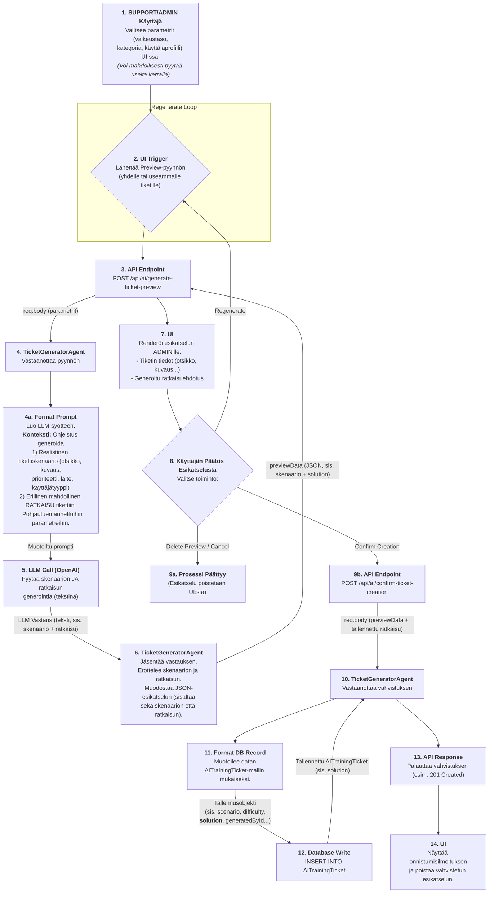
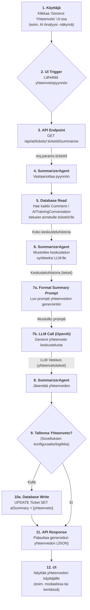

# Tekoälyagentit

Tässä dokumentissa listataan järjestelmässä käytettävät tekoälyagentit, niiden toiminta ja dokumentaatiolinkit.

## Käytössä olevat agentit

| Agentti | Kuvaus | Dokumentaatio |
|---------|--------|---------------|
| TicketGeneratorAgent | Luo realistisia harjoitustikettejä helpdesk-koulutusta varten | [ticketGenerator.md](ticketGenerator.md) |
| ChatAgent | Simuloi käyttäjää keskusteluissa tukihenkilön kanssa | [chatAgent.md](chatAgent.md) |
| SummarizerAgent | Tuottaa tiivistelmän tiketin keskusteluhistoriasta | [summarizerAgent.md](summarizerAgent.md) |
| SupportAssistantAgent | Ohjaa IT-alan opiskelijoita ongelmanratkaisussa ja auttaa heitä oppimaan itsenäisesti. | [supportAssistantAgent.md](supportAssistantAgent.md) |

## Tulevat agentit

Seuraavat agentit ovat suunnitteilla tuleviin versioihin:

| Agentti | Kuvaus | Aikataulu |
|---------|--------|-----------|
| ClassificationAgent | Luokittelee tikettejä kategorioihin ja prioriteetteihin automaattisesti | Tulossa |
| KnowledgeBaseAgent | Hakee relevantteja artikkeleita tietämyskannasta tukihenkilölle | Tulossa |
| ResponseSuggestionAgent | Ehdottaa vastauksia tukihenkilölle yleisiin kysymyksiin | Tulossa |

## Agenttien Työnkulku (Flowcharts)

### TicketGeneratorAgent (Highly Detailed)



### ChatAgent (Highly Detailed)

```mermaid
graph TD
    A["<b>1. SUPPORT/ADMIN</b><br/>Kirjoittaa kommentin AI-tikettiin UI:ssa"] --> B{"<b>2. UI Trigger</b><br/>Lähettää kommentin ja pyytää AI-vastausta"};
    B --> C["<b>3. API Endpoint</b><br/>POST /api/ai/tickets/:id/generate-response"];
    C -- "req.params.id, req.body.comment" --> D["<b>4. ChatAgent</b><br/>Vastaanottaa pyynnön"];
    D --> D1["<b>5. Database Read</b><br/>Hae AITrainingTicket (alkuperäinen skenaario,<br/><b>tavoiteratkaisu (solution)</b>)<br/>JA AITrainingConversation (koko keskusteluhistoria)"];
    D1 -- "Kontekstitiedot" --> D2["<b>6. ChatAgent</b><br/>Muodostaa kontekstin LLM-kutsuja varten"];
    D2 -- "<b>Konteksti Evalille:</b><br/>- Alkuperäinen skenaario<br/>- Tavoiteratkaisu<br/>- Koko keskusteluhistoria" --> E1["<b>7a. Format Eval Prompt</b><br/>Luo prompti edistymisen arviointiin<br/>(esim. 'Kuinka lähellä ratkaisua ollaan?')"];
    E1 -- "Muotoiltu prompti" --> E2["<b>7b. LLM Call (OpenAI)</b><br/>Arvioi keskustelun edistyminen<br/>(evaluateSolutionProgressWithLLM)"];
    E2 -- "LLM Vastaus (esim. 'PROGRESSING')" --> D3["<b>8. ChatAgent</b><br/>Jäsentää edistymisen arvion<br/>(enum: EARLY, PROGRESSING, CLOSE, SOLVED)"];
    subgraph "Vastauksen Muotoilu Perustuen Arvioon"
        direction LR
        D3 -- "evaluationResult" --> F1["<b>9a. Format Reply Prompt</b><br/>Luo prompti vastauksen generointiin.<br/><b>Konteksti Vastaus-LLM:lle:</b><br/>- Alkuperäinen skenaario<br/>- Tavoiteratkaisu<br/>- Koko keskusteluhistoria<br/>- Uusin SUPPORT-kommentti<br/>- <b>evaluationResult (tulos vaiheesta 8)</b><br/>- Ohjeistus käyttäytymiseen:<br/>  <i>EARLY:</i> Kysy tarkentavia kysymyksiä.<br/>  <i>PROGRESSING:</i> Ohjaa kohti ratkaisua.<br/>  <i>CLOSE:</i> Viimeistele, vahvista ymmärrys.<br/>  <i>SOLVED:</i> Totea ratkaisu, kiitä."];
    end
    F1 -- "Muotoiltu, tilanteeseen sopiva prompti" --> F2["<b>9b. LLM Call (OpenAI)</b><br/>Generoi simuloidun käyttäjän vastaus<br/>(generateResponse)"];
    F2 -- "LLM Vastaus (teksti)" --> G["<b>10. ChatAgent</b><br/>Jäsentää generoidun vastauksen"];
    G -- "Vastaus (message),<br/>Arvio (evaluationResult)" --> H["<b>11. Database Write</b><br/>INSERT INTO AITrainingConversation<br/>(message, evaluationResult, senderType='AI'...)"];
    H -- "Tallennettu keskustelutieto" --> G;
    G --> I["<b>12. API Response</b><br/>Palauttaa generoidun vastauksen (JSON)<br/>(sisältäen ehkä evaluationResult?)"];
    I --> J["<b>13. UI</b><br/>Lisää AI:n vastauksen keskusteluun.<br/>Voi näyttää evaluationResult esim. tooltipissä."];
```



### SummarizerAgent (Detailed)



### SupportAssistantAgent (Detailed)

```mermaid
graph TD
    A["<b>1. Tukihenkilö</b><br/>Avaa tikettinäkymän<br/>ja klikkaa Tuki AI -painiketta"] --> B["<b>2. SupportAssistantChat UI</b><br/>Avaa chat-ikkunan<br/>tilassa 'Odottaa kysymystä'"];
    
    B --> C["<b>3. Käyttäjä</b><br/>Kirjoittaa kysymyksen<br/>ja lähettää viestin"];
    
    C --> D["<b>4. UI Komponentti</b><br/>Näyttää latausanimaation<br/>ja lähettää API-pyynnön"];
    
    D --> E["<b>5. API Endpoint</b><br/>POST /api/ai/tickets/:ticketId/support-assistant<br/>Käsittelee pyynnön"];
    
    E --> F["<b>6. AIController</b><br/>Tarkistaa käyttöoikeudet<br/>ja hakee tiketin tiedot"];
    
    F --> G["<b>7. SupportAssistantAgent</b><br/>Vastaanottaa tiketin tiedot<br/>ja käyttäjän kysymyksen"];
    
    G --> H["<b>8. Tietojen kokoaminen</b><br/>- Tiketin tiedot<br/>- Keskusteluhistoria<br/>- Tietämysartikkelit<br/>- Mahdolliset ratkaisut"];
    
    H --> I["<b>9. Promptin formatointi</b><br/>Kokoaa tiedot<br/>LLM-promptiksi"];
    
    I --> J["<b>10. LLM-kutsu</b><br/>Lähettää promptin<br/>OpenAI API:lle"];
    
    J --> K["<b>11. Vastauksen käsittely</b><br/>Muotoilee vastauksen<br/>ja palauttaa sen"];
    
    K --> L["<b>12. API-vastaus</b><br/>Lähettää vastauksen<br/>takaisin frontend-sovellukselle"];
    
    L --> M["<b>13. UI Päivitys</b><br/>Chat-ikkuna näyttää vastauksen<br/>formatoituna viestinä"];
    
    M --> N["<b>14. Interaktiiviset toiminnot</b><br/>- Kopiointi leikepöydälle<br/>- Palaute (peukku ylös/alas)<br/>- Keskustelun jatkaminen"];
    
    N --> O["<b>15. Lisätoiminnot</b><br/>- Keskustelun tyhjennys<br/>- Chat-ikkunan pienennys<br/>- Ikkunan sulkeminen"];
```



## Agenttien integrointi

Kaikki agentit on integroitu järjestelmään käyttäen samaa perusrakennetta:

1. Agentti-luokka: `backend/src/ai/agents/[agenttiNimi].ts`
2. Prompti: `backend/src/ai/prompts/[agenttiNimi]Prompt.ts`
3. Kontrolleri: Kutsu agenttia kontrollerin kautta
4. Rajapinta: Tarjoa API-päätepiste agentin toiminnoille

## Agenttien kehitys

Kun kehität uusia agentteja, seuraa seuraavia periaatteita:

1. Käytä yhtenäistä koodiarkkitehtuuria ja nimeämiskäytäntöjä
2. Kirjoita kattava dokumentaatio agentin toiminnasta
3. Tarjoa selkeät esimerkit käyttötapauksista
4. Varmista tietoturva ja yksityisyys
5. Testaa agenttia perusteellisesti ennen tuotantoon vientiä

## Yhteinen arkkitehtuuri

Kaikki tekoälyagentit käyttävät seuraavaa yhteistä arkkitehtuuria:

1. **LangChain.js-integraatio**:
   - ChatPromptTemplate: Rakenteelliset promptit parametreineen
   - StructuredOutputParser: Jäsennetyn JSON-datan validointi ja käsittely
   - ChatOpenAI: Yhteys OpenAI:n kielimalleihin

2. **Konfiguraatio**:
   - Keskitetty `AI_CONFIG`-objekti (`config.ts`)
   - Ympäristömuuttujapohjainen konfiguraatio (API-avain, mallit)
   - Agenttikohtaiset asetukset konfiguraatiokohteessa

3. **Integraatio järjestelmään**:
   - API-rajapinnat agenttien kutsumiseen (`aiController.ts`)
   - Reitit: Express-reitit agenttitoimintojen käyttöön (`aiRoutes.ts`)
   - Käyttöoikeustarkistukset: Rajoitettu pääsy ADMIN ja SUPPORT -käyttäjille

## Kansiorakenne

```
backend/
├── src/
│   ├── ai/
│   │   ├── agents/           # Yksittäiset agentit
│   │   │   └── ticketGeneratorAgent.ts
│   │   ├── config/           # Tekoälyasetukset
│   │   │   └── aiConfig.ts
│   │   ├── prompts/          # Prompttipohjat
│   │   │   └── ticketGeneratorPrompt.ts
│   │   └── tools/            # Agenttien käyttämät työkalut
```
